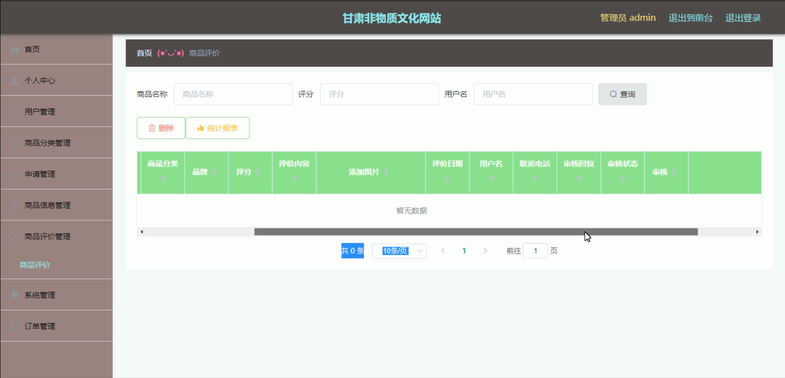

# 基于Springboot的甘肃非物质文化网站

---
### 👉作者QQ ：1556708905 微信：zheng0123Long (支持定制修改、部署调试、定制毕设)

### 👉接网站建设、小程序、H5、APP、各种系统等

---

#### 介绍

基于Springboot的甘肃非物质文化网站是一个专注于展示和推广甘肃非物质文化遗产的平台。该系统旨在提高非物质文化的知名度和影响力，同时为用户提供便捷的购物体验和丰富的文化内容。系统分为管理员角色和用户角色，分别提供了多样化的功能模块，以满足不同用户的需求和职责。

#### 技术栈介绍

后端技术栈：Springboot+Mysql+Maven

前端技术栈：Vue+Html+Css+Javascript+ElementUI

开发工具：Idea+Vscode+Navicate

#### 系统功能介绍

管理员角色功能模块

个人中心：管理员可以查看和编辑个人信息，包括修改密码和更新联系方式，确保个人信息的准确性和安全性。

用户管理：管理员可以管理用户信息，包括新增、修改和删除用户，确保用户信息的完整和准确。

商品分类管理：管理商品分类信息，设置和调整商品分类，确保商品分类的合理和便捷。

申请管理：管理用户的申请信息，包括审核和处理用户的各类申请，确保申请处理的高效和准确。

商品信息管理：管理所有商品的信息，包括新增、修改和删除商品，确保商品信息的及时更新和准确性。

商品评价管理：管理用户对商品的评价信息，包括审核和处理评价，确保评价的真实性和有效性。

系统管理：负责系统配置和管理，包括权限设置、系统日志查看等，确保系统的安全性和稳定性。

订单管理：管理所有订单的信息，包括订单的创建、修改和删除，确保订单处理的高效和准确。

用户角色功能模块

商品信息：用户可以浏览和查看商品的详细信息，选择合适的商品进行购买。

传承人展示：用户可以查看非物质文化遗产传承人的详细信息，了解传承人的故事和技艺。

非物质文化展览：用户可以浏览非物质文化遗产的展览信息，了解和欣赏丰富的文化内容。

个人中心：用户可以查看和编辑个人信息，包括修改密码和更新联系方式，确保个人信息的准确性和安全性。

后台管理：用户可以进行各项管理操作，确保购物体验的便捷和高效。

商品评价管理：用户可以查看和管理自己对商品的评价信息，确保评价的真实性和有效性。

申请管理：用户可以提交和查看自己的各类申请信息，方便及时了解申请进度。

我的收藏管理：用户可以查看和管理自己收藏的商品和文化信息，方便随时查看和购买。

订单管理：用户可以查看和管理自己的订单信息，包括订单的创建、修改和删除，确保订单处理的高效和准确。

购物车：用户可以添加商品到购物车，查看和管理购物车中的商品，方便快捷地进行购物。

客服：用户可以通过客服模块与管理员进行沟通，解决购物过程中的问题，提升购物体验。

#### 系统作用

对管理员的作用

高效管理：系统提供了完善的管理工具，帮助管理员高效地管理用户、商品和订单信息，确保管理工作的高效性和准确性。

信息传达：通过申请管理和商品评价管理模块，管理员可以快速传达和处理重要信息，确保信息的及时传递和沟通。

文化推广：通过传承人展示和非物质文化展览模块，管理员可以有效推广甘肃非物质文化遗产，提升其知名度和影响力。

对用户的作用

文化体验：用户可以通过系统方便地了解和欣赏甘肃非物质文化遗产，提升文化认知和体验。

便捷购物：用户可以通过系统便捷地浏览商品、管理订单和购物车，提升购物体验。

信息获取：用户可以通过系统及时获取传承人和展览信息，确保信息的透明和沟通的顺畅。

问题解决：通过客服模块，用户可以及时解决购物过程中的问题，提升购物满意度。

#### 系统功能截图

代码结构

数据库表

登录

用户管理

商品分类管理

申请管理

商品信息管理

商品评价管理

用户端后台管理

用户端前台页面

购物车

#### 总结

基于Springboot的甘肃非物质文化网站通过角色分工和功能模块的设计，实现了文化展示与电子商务的高效结合。管理员可以通过系统全面管理用户、商品和订单信息，确保文化推广和电商运营的高效性；用户则可以享受便捷的购物体验和丰富的文化内容。该系统不仅提升了非物质文化遗产的知名度和影响力，也为用户提供了便捷的购物和文化体验平台。

#### 使用说明

创建数据库，执行数据库脚本 修改jdbc数据库连接参数 下载安装maven依赖jar 启动idea中的springboot项目

后台管理：http://localhost:8080/feiwuzhiwenhua/admin/dist/index.html#/login   

前台页面：http://localhost:8080/feiwuzhiwenhua/front/pages/login/login.html 

管理员  admin  密码：admin    
